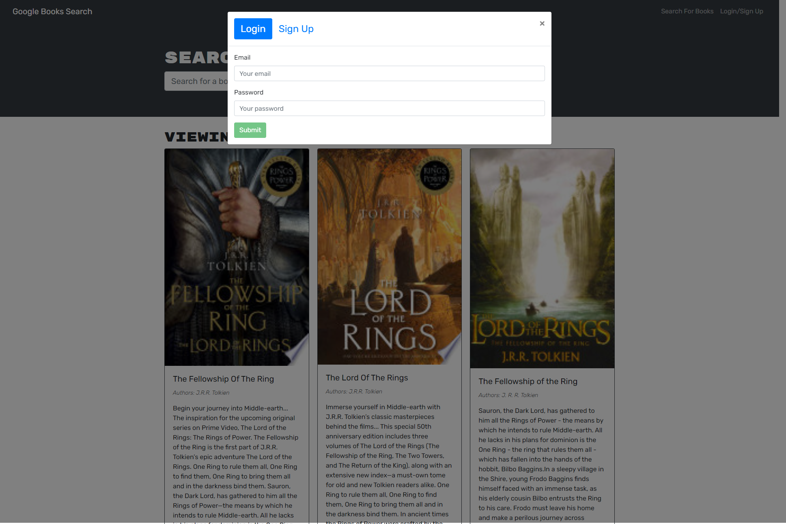
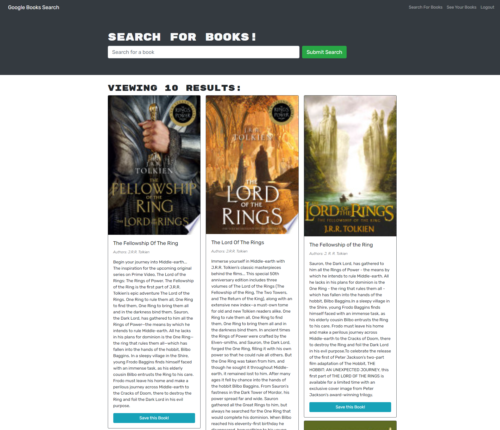

# Book Search Engine

## Licensing:

## Table of Contents 
- [Description](#description)
- [Installation](#installation)
- [Usage](#usage)
- [License](#license)
- [Contributing](#contributing)
- [Tests](#tests)
- [Questions](#questions)

## Description:
This application was created in the UW Coding Bootcamp and refactors a Google Books API search engine from a RESTful API to a GraphQL API with Apollo Server. The search engine is built using the MERN stack - MongoDB, Express.js, React, and Node.js. A user can create an account, search for books, and save them to a list. On a separately rendered page, the user can see their saved books and remove books from the list.

## Usage:

Webpage: https://enigmatic-fortress-04748.herokuapp.com/

Screenshots:

Homepage

Login

Homepage Logged-In

Saved Books

Back-end Installation: 
- Download it through Github
- Run npm i in terminal to install packages
- Running npm run develop will give you access to the Apollo Server (Graph QL) and the localhost webpage

## License:
MIT

## Contributing:
There was already a starter code provided for this project here: https://github.com/coding-boot-camp/solid-broccoli (which is why your see contributors listed in the repo).

Contributions are welcome through forking my repository.

## Tests:
None

## Questions:
- Github: [andreahergert](https://github.com/andreahergert)
- Email: ahergert24@hotmail.com 
